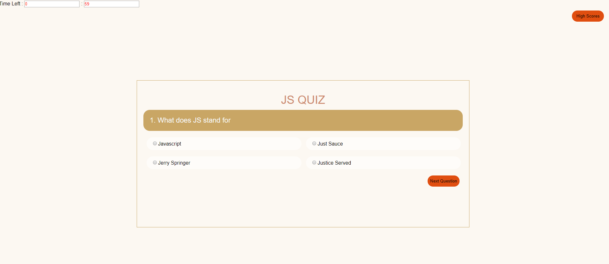

Code-Quiz

This code quiz cycles through five questions saved to an array. Depending on if the user chooses the correct of incorrect answer time is either added or subtracted from the total left. For every correct answer the user is given twenty points. The score is loaded when either all answers are given or the user runs out of time. An answer must be selected before the next question button will allow the user to move on to the following question.

Correct answer: +5 seconds, +20 points.
Incorrect answer: -20 seconds, 0 points.

To Do: Highscore page has not been finished due to time constrants. 

